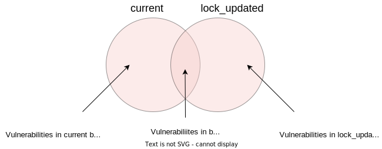
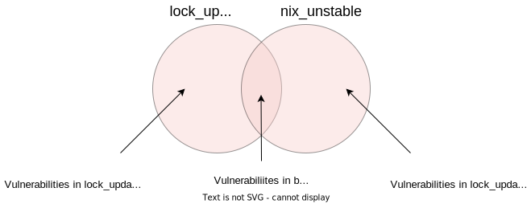

<!--
SPDX-FileCopyrightText: 2023 Technology Innovation Institute (TII)

SPDX-License-Identifier: CC-BY-SA-4.0
-->

# ghafscan

This repository automates vulnerability scans for the [Ghaf Framework](https://github.com/tiiuae/ghaf).
The Ghaf [vulnerability reports](./reports/) available on this repository are automatically updated on [daily basis](./.github/workflows/vulnerability-scan.yml#L12) for the selected Ghaf branches and targets as specified in the [Vulnerability Scan](./.github/workflows/vulnerability-scan.yml) GitHub action workflow. 

## Example Reports
- [Ghaf 'main' generic-x86_64-release](./reports/main/packages.x86_64-linux.generic-x86_64-release.md)
- [Ghaf 'main' riscv64-linux.microchip-icicle-kit-release](./reports/main/packages.riscv64-linux.microchip-icicle-kit-release.md)
- [Ghaf 'ghaf-23.06' generic-x86_64-release](./reports/ghaf-23.06/packages.x86_64-linux.generic-x86_64-release.md)

## Motivation

Key points demonstrated in this repository:
- Running automatic vulnerability scans for nix flake projects, using [Ghaf Framework](https://github.com/tiiuae/ghaf) as an example.
- Using [vulnxscan](https://github.com/tiiuae/sbomnix/tree/main/scripts/vulnxscan) as the main vulnerability scanning tool for a Nix flake project.
- Using Nix flake updates to derive potentially missing security fixes for a Nix flake project. See section [Theory of Operation](./README.md#theory-of-operation) for more details.
- Incorporating [manual analysis](manual_analysis.csv) results to the automated vulnerability scans.

## Theory of Operation

### Vulnxscan

This repository makes use of [vulnxscan](https://github.com/tiiuae/sbomnix/tree/main/scripts/vulnxscan), which allows vulnerability scanning any Nix store paths, including Nix flake outputs. 

Since Nix makes it possible to find buildtime dependencies without compiling the target, [vulnxscan](https://github.com/tiiuae/sbomnix/tree/main/scripts/vulnxscan) can also be used to scan any Nix flake outputs without realising (building) the output target. This makes it possible to scan targets that have not been built earlier and still be able to get the scan results relatively quickly.

### Using Nix flake Updates to Derive Potentially Missing Security Fixes

Projects that make use of the [Nix flakes](https://nixos.wiki/wiki/Flakes) are pinned to a specific Nixpkgs revision. As an example, at the time of writing, the Ghaf main branch is pinned to [github:NixOS/nixpkgs/nixos-23.05](https://github.com/tiiuae/ghaf/blob/a973cabb8452a02332d082fdb6c4783e1d27ffb4/flake.nix#L18) revision [f6de47bd2ff24bb99459f01d04c324dce335aff9](https://github.com/tiiuae/ghaf/blob/a973cabb8452a02332d082fdb6c4783e1d27ffb4/flake.lock#L32). We label this version of Ghaf as '**current**'.

If we now update the Ghaf pin by running `nix flake lock --update-input nixpkgs`, the nixpkgs revision Ghaf is pinned to moves forward to the latest Nixpkgs revision available in the channel Ghaf pins to. This means all Ghaf dependencies are updated to their latest version available in that channel. We label this version of Ghaf as '**lock_updated**'.

If we update the Ghaf pin so that instead of pinning it to nix-release (e.g. github:NixOS/nixpkgs/nixos-23.05), we pin it to nix-unstable (github:NixOS/nixpkgs/nixos-unstable), all Ghaf dependencies will be updated to their latest version available in nix-unstable. We label this version of Ghaf as '**nix_unstable**'.

We can now find potentially missing Ghaf security fixes by comparing the set of vulnerabilities reported by [vulnxscan](https://github.com/tiiuae/sbomnix/tree/main/scripts/vulnxscan) for the three different versions of Ghaf.

#### 'current' vs 'lock_updated'



Vulnerabilities that are in '**current**' set but not in '**lock_updated**', are potentially fixed in nixpkgs channel Ghaf is pinned to, but the fixes have not been included in Ghaf. This set of vulnerabilities would be mitigated by updating the Ghaf flake lock file with `nix flake lock --update-input nixpkgs` or similar. `ghafscan` reports this set of vulnerabilities in each target report in section *[Vulnerabilities Fixed in Ghaf nixpkgs Upstream](https://github.com/tiiuae/ghafscan/blob/main/reports/main/packages.x86_64-linux.generic-x86_64-release.md#vulnerabilities-fixed-in-ghaf-nixpkgs-upstream)*.


#### 'lock_updated' vs 'nix_unstable'



Vulnerabilities that are in '**lock_updated**' set but not in '**nix_unstable**', are potentially fixed in nixpkgs nix-unstable channel, but the fixes have not been backported to the channel Ghaf is currently pinned to. This set of vulnerabilities potentially requires backporting the fix from nix-unstable to the nixpkgs release branch Ghaf is currently pinned to. `ghafscan` reports this set of vulnerabilities in each target report in section *[Vulnerabilities Fixed in nix-unstable](https://github.com/tiiuae/ghafscan/blob/main/reports/main/packages.x86_64-linux.generic-x86_64-release.md#vulnerabilities-fixed-in-nix-unstable)*.

## Running Locally
This repository demonstrates how to run `ghafscan` from Github actions, but `ghafscan` can be run locally too.
It requires that common [Nix](https://nixos.org/download.html) tools are available in `$PATH` and assumes [nix flakes](https://nixos.wiki/wiki/Flakes#Enable_flakes) is enabled.
### Running as Nix Flake
`ghafscan` can be run as a [Nix flake](https://nixos.wiki/wiki/Flakes) from the `tiiuae/ghafscan` repository:
```bash
# '--' signifies the end of argument list for `nix`.
# '--help' is the first argument to `ghafscan`
$ nix run github:tiiuae/ghafscan#ghafscan -- --help
```

or from a local repository:
```bash
$ git clone https://github.com/tiiuae/ghafscan
$ cd ghafscan
$ nix run .#ghafscan -- --help
```
See the full list of supported flake targets by running `nix flake show`.

### Running from Nix Development Shell

To start a local development shell, run:
```bash
$ git clone https://github.com/tiiuae/ghafscan
$ cd ghafscan 
$ nix develop
```

From the development shell, run `ghafscan` as follows:
```bash
$ ghafscan --help
```

To deactivate the Nix development shell, run `exit` in your shell.

## Contribute
All pull requests, suggestions, and error reports are welcome.
To start development, we recommend using Nix flakes [development shell](./README.md#running-from-nix-development-shell).

Run `make help` in the development shell to see the list of supported make targets.
Prior to sending any pull requests, make sure at least the `make pre-push` runs without failures.

## License

This project is licensed under the Apache-2.0 license - see the [Apache-2.0.txt](LICENSES/Apache-2.0.txt) file for details.
